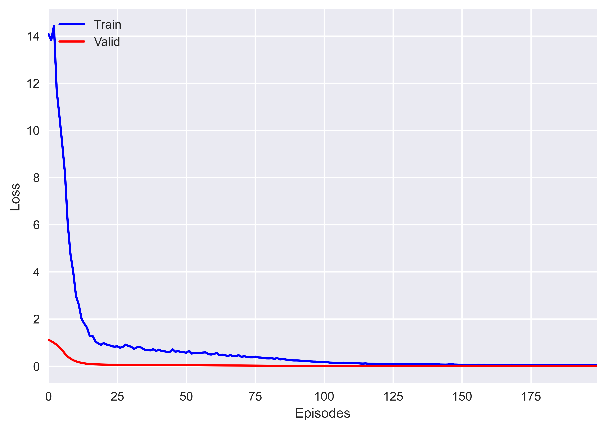
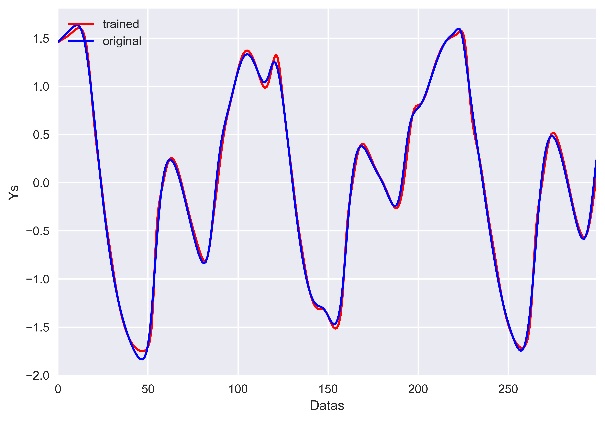
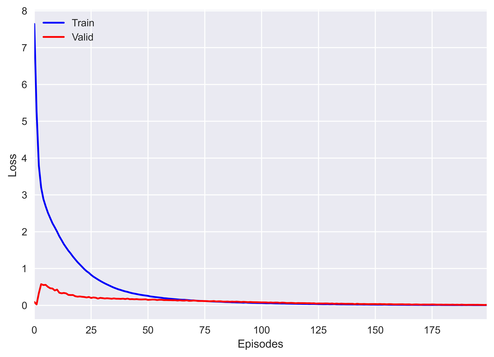
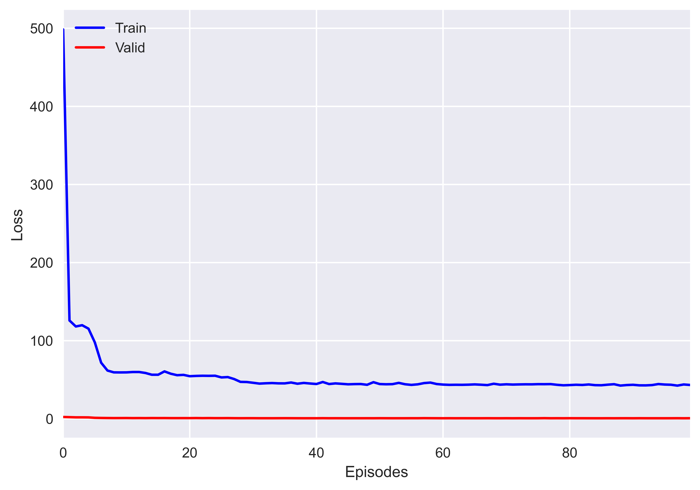
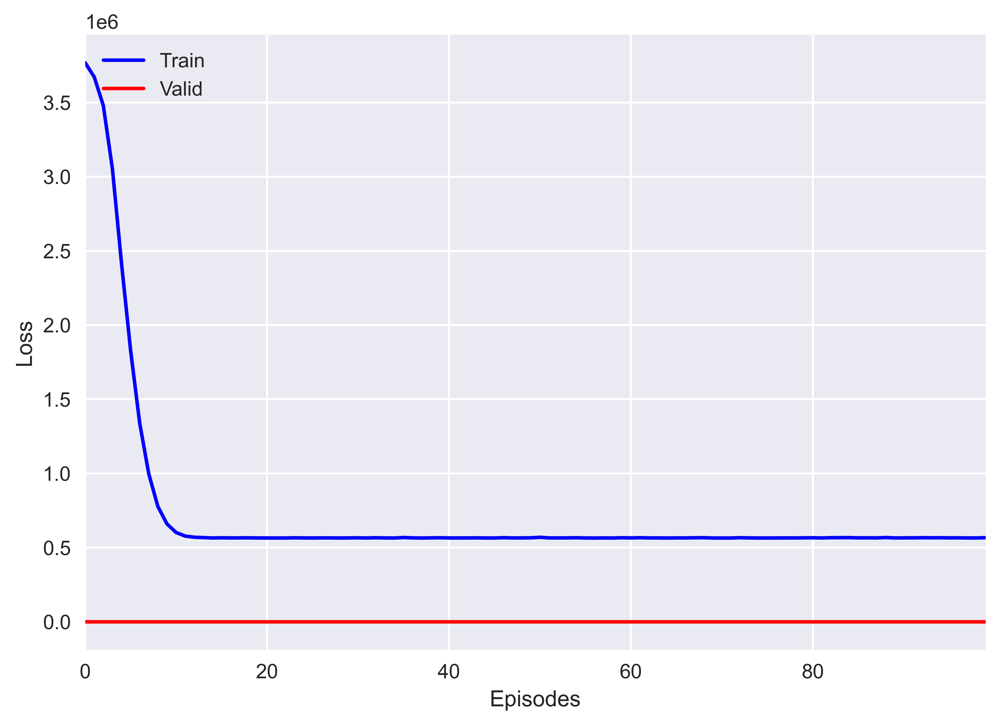

## Description
This repository hosts a Python implementation of paper UNFIS: A Novel Neuro-Fuzzy Inference System with Unstructured fuzzy rules.

## UNFIS
here are two versions for classification (UNFIS-c) and regression (UNFIS-r) which their difference is in their last layer. These structures realize TSK adaptive neuro-fuzzy inference systems
for classification and regression tasks, which are able to adjust the effect of different input variables in constructing different fuzzy rules. As a result, they have the ability to create 
unstructured fuzzy rules of varying lengths, taking into account the impact of varied numbers of input variables. The primary distinction between the suggested framework and a typical 
TSK-FNN is in the inclusion of Fuzzy Selection Neurons, which are responsible for selecting various input variables.

## Requirements
The code is implemented in Python 3.8.10 and has been tested on Windows 10 without encountering any issues. Below are the non-standard libraries and their corresponding versions used in writing the code:
<pre>
matplotlib==3.5.1
numpy==1.22.0
torch==2.0.1+cu118
</pre>

## Usage
simply run the code to train the model for data set. you can run each clasification and regression for different dataset by run_unfis files

## Showcase
You can view the training procedure through the following photos, demonstrating the learned process across episodes. the first three are for regression loss for macky gluss, sinc and sin.
the adjoining 3 are the data points ploted.the next 2 are classification loss for iris and wine and the exepted Results respectively

| mackey loss| prediction mackey|
|:-:|:-:|

| Sinc loss| prediction Sinc|
|:-:|:-:|

| Sin loss| prediction Sin|
|:-:|:-:|

    
iris

    
    

    
Wine

    
    

